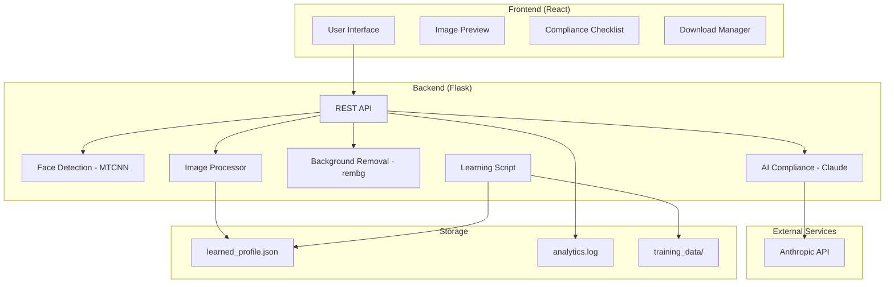

# Design Document

## Overview

The Passport Photo Processor is a full-stack web application that automates the conversion of user photos into compliant U.S. passport and visa photos. The system architecture follows a client-server model with a React frontend and Flask backend, leveraging multiple AI/ML models for face detection, background removal, and compliance analysis.

The application workflow consists of:
1. User uploads a photo through the web interface
2. Backend performs face detection using MTCNN
3. Backend analyzes compliance using Claude AI (optional)
4. Backend removes background using rembg (optional)
5. Backend crops and resizes to exact passport specifications
6. Frontend displays compliance checklist and processed photo
7. User downloads single photo or print sheets

## Architecture

### System Architecture



### Technology Stack

**Frontend:**
- React 18.2 - UI framework
- Tailwind CSS 3.3 - Styling
- Lucide React - Icon library
- Create React App - Build tooling

**Backend:**
- Flask - Web framework
- Flask-CORS - Cross-origin resource sharing
- Gunicorn - WSGI HTTP server

**Computer Vision & ML:**
- OpenCV Haar Cascades - Face and eye detection
- OpenCV - Image processing
- rembg - Background removal (U-2-Net model)
- Pillow - Image manipulation
- NumPy - Numerical operations

**AI Integration:**
- Anthropic Claude API - Qualitative compliance analysis

**Deployment:**
- Docker & Docker Compose - Containerization

## Components and Interfaces

### Frontend Components

#### PassportPhotoApp (Main Component)
**State Management:**
- `file`: Uploaded file object
- `preview`: Base64 preview of original image
- `loading`: Processing status boolean
- `analysis`: Object containing face detection and AI analysis results
- `processedImage`: Base64 string of processed photo
- `error`: Error message string
- `removeBackground`: Boolean toggle for background removal

**Key Methods:**
- `handleFileChange(event)`: Handles file input and creates preview
- `processImage(file)`: Sends image to backend API and handles response
- `resetState()`: Clears all state and returns to upload screen
- `downloadSinglePhoto()`: Downloads processed 2x2 photo
- `downloadPrintSheet(paperSize)`: Generates and downloads print sheet

#### ComplianceChecklist Component
**Props:**
- `analysis`: Analysis results from backend
- `loading`: Processing status
- `removeBackground`: Background removal toggle state

**Displays:**
- High resolution check (≥600x600)
- Head centered check
- Correct head size check (50-69% height ratio)
- Plain background check
- Neutral expression check
- Eyes open check
- No shadows check
- No obstructions check

#### ComplianceItem Component
**Props:**
- `text`: Check description
- `compliant`: Boolean or null (true=pass, false=fail, null=pending)
- `loading`: Processing status

**Renders:** Icon (checkmark, X, or dot) with status text

#### FinalChecks Component
**Props:**
- `analysis`: Analysis results
- `removeBackground`: Background removal state

**Displays:** Confirmation of final photo compliance attributes

### Backend Components

#### PassportPhotoProcessor Class

**Constants:**
- `PASSPORT_SIZE_PIXELS`: (600, 600)
- `HEAD_HEIGHT_MIN`: 0.50
- `HEAD_HEIGHT_MAX`: 0.69
- `LEARNED_PROFILE_PATH`: Path to learned profile JSON

**Methods:**

`__init__()`
- Initializes MTCNN detector
- Loads learned profile if available

`detect_face_and_features(image_path) -> dict`
- Resizes large images for performance (max 1024px)
- Detects faces using OpenCV Haar Cascade classifier
- Detects eyes within face region for additional validation
- Returns face count, bounding box, head height ratio, centering status
- Returns error dict if 0 or >1 faces detected

`analyze_with_ai(image_path) -> dict` (async)
- Encodes image as base64
- Sends to Claude API with structured compliance prompt
- Parses JSON response for compliance status and issues
- Returns success status and analysis object

`remove_background(img) -> Image`
- Uses rembg to isolate foreground
- Replaces background with white (255, 255, 255)
- Returns original image if removal fails

`process_to_passport_photo(image_path, face_bbox, remove_bg) -> BytesIO`
- Loads and thumbnails image to max 1200px
- Removes background if requested
- Calculates crop using learned profile or default rules
- Crops to square centered on face
- Resizes to 600x600 at 300 DPI
- Applies brightness (1.05) and contrast (1.1) enhancement
- Returns JPEG buffer at 95% quality

`load_learned_profile() -> dict`
- Loads learned_profile.json if exists
- Returns None if not found

#### API Endpoints

**POST /api/full-workflow**
- Accepts: multipart/form-data with 'image' file, 'use_ai' boolean, 'remove_background' boolean
- Converts HEIC to JPEG if needed
- Validates minimum resolution (600x600)
- Performs face detection
- Performs AI analysis if requested
- Processes image to passport photo
- Returns JSON with analysis and base64 processed image

**POST /api/log-event**
- Accepts: JSON event data
- Adds server-side UTC timestamp
- Logs to analytics.log as JSON line
- Returns success status

#### Learning Script (learn_from_samples.py)

**PassportPhotoAnalyzer Class:**

`analyze_image_features(image_path) -> dict`
- Detects face using Haar Cascade
- Calculates head_height_ratio, face_center_x_ratio, head_top_y_ratio
- Returns None if face count ≠ 1

**Function:**

`learn_from_directory(training_path, output_file)`
- Iterates through training_data directory
- Analyzes each JPEG/PNG image
- Computes mean and standard deviation for all ratios
- Saves to learned_profile.json

## Data Models

### Face Detection Result
```typescript
{
  faces_detected: number,
  valid: boolean,
  error?: string,
  face_bbox?: {
    x: number,
    y: number,
    width: number,
    height: number
  },
  eyes_detected?: number,
  head_height_percent?: number,
  head_height_valid?: boolean,
  horizontally_centered?: boolean,
  image_dimensions?: {
    width: number,
    height: number
  }
}
```

### AI Analysis Result
```typescript
{
  success: boolean,
  error?: string,
  ai_analysis?: {
    compliant: boolean,
    issues: string[],
    analysis_details: {
      background_ok: boolean,
      expression_neutral: boolean,
      eyes_open: boolean,
      no_eyeglasses: boolean,
      no_head_covering_issue: boolean,
      lighting_ok: boolean,
      no_obstructions?: boolean
    }
  }
}
```

### Full Workflow Response
```typescript
{
  success: boolean,
  feasible: boolean,
  analysis: {
    face_detection: FaceDetectionResult,
    ai_analysis: AIAnalysisResult | null
  },
  processed_image?: string, // base64
  message: string
}
```

### Learned Profile
```json
{
  "mean": {
    "head_height_ratio": number,
    "face_center_x_ratio": number,
    "head_top_y_ratio": number
  },
  "std_dev": {
    "head_height_ratio": number,
    "face_center_x_ratio": number,
    "head_top_y_ratio": number
  },
  "sample_size": number
}
```

### Analytics Event
```json
{
  "event_type": "processing" | "download",
  "status": "success" | "partial_success" | "failure" | "error" | "single_photo" | "print_sheet",
  "details": {
    "face_detected"?: boolean,
    "ai_compliant"?: boolean,
    "ai_issues"?: string[],
    "error_message"?: string,
    "paper_size"?: "4x6" | "5x7"
  },
  "client_timestamp": string,
  "timestamp": string
}
```


## Correctness Properties

*A property is a characteristic or behavior that should hold true across all valid executions of a system—essentially, a formal statement about what the system should do. Properties serve as the bridge between human-readable specifications and machine-verifiable correctness guarantees.*

### Property 1: Format acceptance
*For any* uploaded image file with JPEG, PNG, or HEIC extension, the system should accept the file for processing
**Validates: Requirements 1.1**

### Property 2: HEIC conversion round-trip
*For any* HEIC file uploaded, the processing pipeline should receive JPEG-formatted data
**Validates: Requirements 1.2**

### Property 3: Resolution validation
*For any* image with dimensions below 600x600 pixels, the system should reject the image with a resolution error message
**Validates: Requirements 1.4**

### Property 4: Single face bounding box extraction
*For any* image containing exactly one detected face, the system should return valid bounding box coordinates (x, y, width, height)
**Validates: Requirements 2.4**

### Property 5: Head height ratio calculation
*For any* detected face, the head height ratio should equal the face height divided by the image height
**Validates: Requirements 2.6**

### Property 6: Head height validation
*For any* head height ratio between 0.50 and 0.69 (inclusive), the system should mark the head height as valid
**Validates: Requirements 2.7**

### Property 7: Horizontal centering validation
*For any* face where the face center x-coordinate is within 30% of the image center, the system should mark the face as horizontally centered
**Validates: Requirements 2.8**

### Property 8: Image encoding for AI
*For any* image sent to AI analysis, the image should be encoded as base64 with the correct media type (image/jpeg or image/png)
**Validates: Requirements 3.2**

### Property 9: AI response parsing
*For any* valid JSON response from the AI, the system should successfully parse the compliance status and issues list
**Validates: Requirements 3.4**

### Property 10: AI issues extraction
*For any* AI response indicating non-compliance, the system should extract and return the list of specific issues
**Validates: Requirements 3.5**

### Property 11: Background color replacement
*For any* image processed with background removal enabled, all background pixels should be white (RGB 255, 255, 255)
**Validates: Requirements 4.2**

### Property 12: Foreground preservation
*For any* image processed with background removal, the foreground subject pixels should remain substantially similar to the original
**Validates: Requirements 4.3**

### Property 13: Output dimensions invariant
*For any* processed passport photo, the output image should be exactly 600x600 pixels at 300 DPI
**Validates: Requirements 5.1**

### Property 14: Face centering after crop
*For any* image with a valid detected face, the processed photo should have the face centered according to passport specifications
**Validates: Requirements 5.2**

### Property 15: Crop boundary constraints
*For any* calculated crop dimensions, the crop area coordinates should remain within the original image boundaries
**Validates: Requirements 5.5**

### Property 16: Brightness and contrast enhancement
*For any* processed image, the brightness enhancement factor should be 1.05 and contrast enhancement factor should be 1.1
**Validates: Requirements 5.7**

### Property 17: Output format specifications
*For any* saved processed image, the format should be JPEG with 95% quality and 300 DPI resolution
**Validates: Requirements 5.8**

### Property 18: Training data processing
*For any* JPEG or PNG file in the training_data directory, the learning script should attempt to analyze it
**Validates: Requirements 6.1**

### Property 19: Geometric ratio calculation
*For any* face detected by the learning script, the output should include head_height_ratio, face_center_x_ratio, and head_top_y_ratio
**Validates: Requirements 6.3**

### Property 20: Statistical profile computation
*For any* set of analyzed training images, the learned profile should contain correctly computed mean and standard deviation for all geometric ratios
**Validates: Requirements 6.4**

### Property 21: Profile persistence
*For any* successful learning script execution, a valid learned_profile.json file should be created with the statistical data
**Validates: Requirements 6.5**

### Property 22: Face detection failure cascade
*For any* image where face detection fails, all face-dependent compliance checks (centered, head size) should be marked as failed
**Validates: Requirements 7.5**

### Property 23: 4x6 print sheet specifications
*For any* 4x6 print sheet generated, the output should be 1800x1200 pixels at 300 DPI with exactly 2 photos arranged horizontally
**Validates: Requirements 8.4**

### Property 24: 5x7 print sheet specifications
*For any* 5x7 print sheet generated, the output should be 2100x1500 pixels at 300 DPI with exactly 4 photos in a 2x2 grid
**Validates: Requirements 8.5**

### Property 25: Print sheet cutting guides
*For any* generated print sheet, dashed cutting guide lines should be present around each photo
**Validates: Requirements 8.6**

### Property 26: Print sheet margin equality
*For any* generated print sheet, the margins between photos should be equal
**Validates: Requirements 8.7**

### Property 27: Processing event logging
*For any* completed photo processing operation, an analytics event should be logged with the processing status
**Validates: Requirements 10.1**

### Property 28: Compliance status logging
*For any* successful processing operation, the log should include whether the photo is fully compliant or partially compliant
**Validates: Requirements 10.2**

### Property 29: Download event logging
*For any* photo download action, a download event should be logged with the download type (single_photo or print_sheet)
**Validates: Requirements 10.4**

### Property 30: Log timestamp inclusion
*For any* logged event, the entry should include a server-side UTC timestamp
**Validates: Requirements 10.5**

### Property 31: Log format consistency
*For any* logged event, the entry should be valid JSON written as a single line in analytics.log
**Validates: Requirements 10.6**

## Error Handling

### Frontend Error Handling

**File Upload Errors:**
- Invalid file type: Display error message and prevent upload
- File too large (>16MB): Display error message and prevent upload
- Network errors: Display user-friendly error message with retry option

**Processing Errors:**
- API unreachable: Display connection error with retry button
- Processing timeout: Display timeout message and suggest retry
- Invalid response: Display generic error and log details to console

**State Management:**
- All errors stored in `error` state variable
- Errors displayed in red alert box with icon
- Errors cleared when user starts over or uploads new file

### Backend Error Handling

**Image Processing Errors:**
- HEIC conversion failure: Return 500 error with message
- Face detection failure: Return success with error in analysis object
- AI API failure: Continue processing, return null for AI analysis
- Background removal failure: Return original image without background removal

**File Handling:**
- Missing file in request: Return 400 error
- Temporary file cleanup: Always delete temp files in finally block
- Directory creation: Create logs directory if not exists

**API Errors:**
- Anthropic API errors: Catch and return error status without crashing
- Invalid API key: Return error message about configuration
- Rate limiting: Return error with retry suggestion

### Learning Script Error Handling

**File Processing:**
- Invalid images: Skip and log warning
- Wrong face count: Skip and log warning
- Missing directory: Display error and exit

**Output:**
- No valid faces found: Display error and don't create profile
- File write errors: Display error message

## Testing Strategy

### Unit Testing

**Frontend Unit Tests (Jest + React Testing Library):**
- Component rendering tests for all UI components
- State management tests for file upload, processing, and reset flows
- Event handler tests for button clicks and toggle changes
- Props validation tests for ComplianceChecklist and ComplianceItem
- Download functionality tests (mocked)

**Backend Unit Tests (pytest):**
- Face detection with known test images (0, 1, multiple faces)
- Head height ratio calculation with various face sizes
- Centering calculation with various face positions
- HEIC to JPEG conversion with sample files
- Background removal with test images
- Crop calculation with and without learned profile
- Image enhancement verification
- Analytics logging format validation

**Learning Script Unit Tests (pytest):**
- Feature extraction from test images
- Statistical calculation verification (mean, std dev)
- JSON output format validation
- Error handling for invalid images

### Property-Based Testing

The system will use **Hypothesis** (Python) for backend property-based testing and **fast-check** (JavaScript) for frontend property-based testing.

**Configuration:**
- Minimum 100 iterations per property test
- Each property test tagged with: `**Feature: passport-photo-processor, Property {number}: {property_text}**`
- Each property test references the design document property it implements

**Backend Property Tests:**

Property tests for:
- Format acceptance (Property 1)
- Resolution validation (Property 3)
- Head height ratio calculation (Property 5)
- Head height validation (Property 6)
- Horizontal centering validation (Property 7)
- Background color replacement (Property 11)
- Output dimensions invariant (Property 13)
- Crop boundary constraints (Property 15)
- Output format specifications (Property 17)
- Statistical profile computation (Property 20)
- Print sheet specifications (Properties 23, 24)
- Log format consistency (Property 31)

**Frontend Property Tests:**

Property tests for:
- Face detection failure cascade (Property 22)
- State management invariants
- UI rendering consistency

**Test Data Generators:**

*Image Generators:*
- Random dimensions (100x100 to 4000x4000)
- Random face positions and sizes
- Random background colors
- Various file formats

*Face Detection Generators:*
- Images with 0, 1, or multiple faces
- Faces at various positions (centered, off-center)
- Faces at various sizes (too small, valid, too large)

*Profile Generators:*
- Random geometric ratios within valid ranges
- Random sample sizes (1-100)

### Integration Testing

**End-to-End Workflow Tests:**
- Upload → Face Detection → AI Analysis → Processing → Download
- Upload → Face Detection → Processing (no AI) → Download
- Upload → Background Removal → Processing → Download
- Upload → Print Sheet Generation → Download

**API Integration Tests:**
- Full workflow endpoint with various image types
- Analytics logging endpoint
- Error scenarios (missing file, invalid format, etc.)

**External Service Integration:**
- Anthropic API integration (with mocked responses for CI/CD)
- OpenCV Haar Cascade model loading
- rembg model loading and inference

### Test Environment

**Frontend:**
- Jest test runner
- React Testing Library for component tests
- fast-check for property-based tests
- Mock Service Worker for API mocking

**Backend:**
- pytest test runner
- Hypothesis for property-based tests
- pytest-mock for mocking external services
- Test fixtures for sample images

**CI/CD:**
- Run all tests on pull requests
- Separate test suites for unit, property, and integration tests
- Code coverage reporting (target: 80%+)
- Performance benchmarks for image processing

## Security Considerations

**File Upload Security:**
- File size limits (16MB) to prevent DoS
- File type validation (whitelist only)
- Temporary file cleanup to prevent disk filling
- No execution of uploaded files

**API Security:**
- CORS configuration for allowed origins
- API key stored in environment variables
- No sensitive data in logs
- Rate limiting on endpoints (recommended for production)

**Data Privacy:**
- No permanent storage of uploaded images
- Temporary files deleted immediately after processing
- Analytics logs contain no PII
- No image data sent to third parties except Anthropic (optional)

**Dependency Security:**
- Regular updates of dependencies
- Security scanning of Docker images
- Minimal base images for containers

## Quality Standards

**Government Compliance:**
The system adheres to U.S. Department of State passport photo quality requirements:

- **Resolution**: 600x600 pixels minimum at 300 DPI
- **JPEG Quality**: 95% (high quality, minimal compression)
- **Chroma Subsampling**: 4:4:4 (no color subsampling for maximum fidelity)
- **Color Space**: sRGB color space
- **File Format**: JPEG with optimized encoding
- **Enhancement**: Minimal (brightness 1.05x, contrast 1.1x for natural appearance)

**Quality Preservation Throughout Pipeline:**

1. **HEIC Conversion**: 95% quality, 4:4:4 subsampling, optimized encoding
2. **Initial Processing**: Preserve original resolution up to 2400px (increased from 1200px)
3. **Resampling**: LANCZOS algorithm (highest quality) for all resize operations
4. **Final Output**: 95% JPEG quality, 300 DPI, 4:4:4 subsampling

## Performance Considerations

**Image Processing Optimization:**
- Resize large images before face detection (max 1024px)
- Preserve quality during processing (max 2400px before final crop)
- Use LANCZOS resampling for highest quality
- Lazy loading of ML models

**Frontend Performance:**
- Image preview optimization
- Debounced API calls
- Loading states to prevent duplicate requests
- Efficient re-rendering with React hooks

**Backend Performance:**
- Async AI analysis to prevent blocking
- Efficient image format conversions
- Memory-efficient image processing with Pillow
- Gunicorn for production WSGI serving

**Expected Performance:**
- Face detection: <2 seconds for typical images
- Background removal: <3 seconds
- AI analysis: <5 seconds (depends on Anthropic API)
- Total processing: <10 seconds for full workflow

## Deployment

**Docker Deployment:**
- Multi-stage builds for optimized images
- Separate containers for frontend and backend
- Docker Compose for local development
- Environment variable configuration

**Production Considerations:**
- Gunicorn with multiple workers for backend
- Nginx reverse proxy for frontend
- HTTPS/TLS encryption
- CDN for static assets
- Health check endpoints
- Logging and monitoring
- Backup of learned profiles

**Scaling:**
- Horizontal scaling of backend workers
- Load balancing across instances
- Shared storage for learned profiles
- Centralized logging

## Future Enhancements

**Potential Features:**
- Support for other country passport specifications
- Batch processing of multiple photos
- Mobile app version
- Advanced editing tools (brightness, contrast, rotation)
- Face beautification options
- Automatic retake suggestions
- Integration with passport application services
- Multi-language support
- Accessibility improvements (screen reader support, keyboard navigation)
