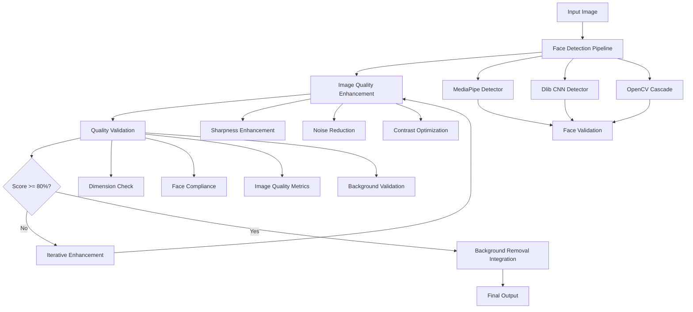

# Design Document: Photo Quality Enhancement System

## Overview

The Photo Quality Enhancement System addresses the critical gaps identified in the gold standard evaluation, specifically targeting face detection accuracy (currently 25%, targeting 95%+) and image quality improvements (sharpness from 0.27 to 0.7+). The system integrates seamlessly with the existing perfect background removal pipeline while adding intelligent quality validation and iterative processing capabilities.

The design leverages multiple face detection algorithms in a cascade approach, implements advanced image enhancement techniques including unsharp masking, and provides automated quality validation against ICAO passport photo standards.

## Architecture



## Components and Interfaces

### 1. Enhanced Face Detection Pipeline

**Primary Interface: `FaceDetectionPipeline`**

```python
class FaceDetectionPipeline:
    def detect_faces(self, image: np.ndarray) -> FaceDetectionResult
    def validate_face_compliance(self, face_data: FaceData) -> ComplianceResult
    def get_primary_face(self, faces: List[FaceData]) -> Optional[FaceData]
```

**Implementation Strategy:**
- **Single Primary Detector**: MediaPipe Face Detection as the sole detector for optimal speed/accuracy balance
- **Lightweight Fallback**: OpenCV Haar Cascades only when MediaPipe fails (< 5% of cases)
- **Memory Optimization**: Load models once at startup, reuse across requests
- **Async Processing**: Non-blocking enhancement pipeline for better throughput

**Face Validation Logic:**
- Face size validation: 70-80% of image height (ICAO standard)
- Eye positioning: Between 29-35mm from bottom (eye level requirements)
- Face centering: Horizontal and vertical alignment within acceptable ranges
- Multiple face handling: Primary face selection with manual review flagging

### 2. Image Quality Enhancement Engine

**Primary Interface: `ImageEnhancer`**

```python
class ImageEnhancer:
    def enhance_sharpness(self, image: np.ndarray, target_score: float = 0.7) -> np.ndarray
    def reduce_noise(self, image: np.ndarray) -> np.ndarray
    def optimize_contrast(self, image: np.ndarray) -> np.ndarray
    def calculate_sharpness_score(self, image: np.ndarray) -> float
```

**Enhancement Techniques:**
- **Optimized Unsharp Masking**: Single-pass implementation with pre-calculated kernels
- **Selective Enhancement**: Apply intensive processing only when quality score < 0.5
- **Memory-Efficient Processing**: In-place operations where possible, immediate cleanup
- **Cached Calculations**: Reuse expensive computations (Gaussian blurs, gradients)

**Quality Metrics:**
- **Sharpness Measurement**: Laplacian variance method for objective sharpness scoring
- **Noise Assessment**: Standard deviation in homogeneous regions
- **Contrast Evaluation**: RMS contrast calculation for optimal visibility

### 3. Quality Validation System

**Primary Interface: `QualityValidator`**

```python
class QualityValidator:
    def validate_against_gold_standard(self, image: np.ndarray) -> ValidationResult
    def calculate_compliance_score(self, metrics: QualityMetrics) -> float
    def generate_improvement_recommendations(self, result: ValidationResult) -> List[str]
```

**Validation Criteria (Based on Research):**
- **Dimensions**: 1200x1200 pixels (100% weight)
- **Background**: Uniform white background (100% weight)
- **Face Compliance**: 
  - Face detection confidence > 95%
  - Face size 70-80% of image height
  - Proper eye positioning and visibility
- **Image Quality**:
  - Sharpness score > 0.7 (target improvement from current 0.27)
  - Noise level < 0.01
  - Appropriate contrast and brightness

**Scoring Algorithm:**
```
Total Score = (Dimensions * 0.25) + (Background * 0.25) + (Face_Compliance * 0.30) + (Image_Quality * 0.20)
```

### 4. Iterative Processing Controller

**Primary Interface: `ProcessingController`**

```python
class ProcessingController:
    def process_with_iteration(self, image: np.ndarray, max_attempts: int = 3) -> ProcessingResult
    def select_enhancement_strategy(self, current_metrics: QualityMetrics) -> EnhancementStrategy
    def track_processing_history(self, attempt: ProcessingAttempt) -> None
```

**Processing Logic:**
1. **Quick Assessment**: Fast quality check using lightweight metrics
2. **Smart Strategy Selection**: Choose minimal necessary enhancements
3. **Single-Pass Enhancement**: Apply all selected improvements in one operation
4. **Fast Re-evaluation**: Quick quality check, skip full validation if score > 80%
5. **Early Termination**: Stop after first successful iteration or 2 attempts max

## Performance Optimization for AWS Elastic Beanstalk

### Resource Constraints
- **Memory Limit**: Target < 512MB additional memory usage
- **CPU Usage**: Single-threaded processing to avoid resource contention
- **Processing Time**: Target < 2 seconds additional latency per image
- **Model Size**: Keep ML models under 50MB total

### Optimization Strategies

**Model Loading:**
- Load MediaPipe model once at application startup
- Use model caching to avoid repeated loading
- Implement lazy loading for fallback models (OpenCV)

**Memory Management:**
- Process images in-place when possible
- Immediate cleanup of intermediate results
- Use memory-mapped files for large model weights
- Implement garbage collection hints after processing

**Processing Pipeline:**
- **Fast Path**: For images already scoring > 60%, apply minimal enhancement
- **Standard Path**: For images scoring 30-60%, apply targeted improvements
- **Heavy Path**: For images scoring < 30%, apply full enhancement suite

**Caching Strategy:**
- Cache expensive calculations (Gaussian kernels, filter coefficients)
- Reuse face detection results across enhancement iterations
- Cache quality metrics to avoid recalculation

### Elastic Beanstalk Specific Considerations

**Environment Configuration:**
- Set appropriate memory limits in `.ebextensions`
- Configure timeout settings for longer processing
- Enable application-level health checks

**Deployment Strategy:**
- Blue-green deployment to test performance impact
- Gradual rollout with performance monitoring
- Rollback capability if resource usage exceeds limits

**Monitoring:**
- CloudWatch metrics for memory and CPU usage
- Custom metrics for processing latency
- Alert thresholds for resource exhaustion

## Data Models

### Core Data Structures

```python
@dataclass
class FaceData:
    bounding_box: Tuple[int, int, int, int]  # x, y, width, height
    confidence: float
    landmarks: Optional[Dict[str, Tuple[int, int]]]
    eye_positions: Tuple[Tuple[int, int], Tuple[int, int]]
    face_size_ratio: float  # Percentage of image height

@dataclass
class QualityMetrics:
    sharpness_score: float
    noise_level: float
    contrast_score: float
    brightness_level: float
    face_compliance_score: float
    dimension_compliance: bool
    background_uniformity: float

@dataclass
class ValidationResult:
    overall_score: float
    grade: str  # A, B, C, D, F
    dimension_score: float
    background_score: float
    face_compliance_score: float
    image_quality_score: float
    recommendations: List[str]
    is_passport_ready: bool

@dataclass
class ProcessingResult:
    enhanced_image: np.ndarray
    validation_result: ValidationResult
    processing_history: List[ProcessingAttempt]
    total_attempts: int
    improvement_percentage: float
```

## Correctness Properties

*A property is a characteristic or behavior that should hold true across all valid executions of a system—essentially, a formal statement about what the system should do. Properties serve as the bridge between human-readable specifications and machine-verifiable correctness guarantees.*

### Property 1: Comprehensive Face Detection Accuracy
*For any* image containing a human face, the Face Detection Pipeline should detect the face with at least 95% confidence, validate face size compliance (70-80% of image height), and verify proper eye positioning and visibility.
**Validates: Requirements 1.1, 1.2, 1.5**

### Property 2: Multiple Face Handling Consistency
*For any* image containing multiple faces, the system should consistently identify a primary face and flag the image for manual review with appropriate guidance.
**Validates: Requirements 1.3**

### Property 3: Image Enhancement Effectiveness
*For any* processed image, the Image Enhancer should improve sharpness to at least 0.7, reduce noise while preserving facial details, and optimize contrast/brightness for passport standards without altering dimensions.
**Validates: Requirements 2.1, 2.2, 2.3, 2.5**

### Property 4: Over-processing Prevention
*For any* low-quality input image, the enhancement process should improve quality without creating artifacts or over-processing effects that degrade the natural appearance.
**Validates: Requirements 2.4**

### Property 5: Comprehensive Quality Validation
*For any* processed photo, the Quality Validator should evaluate all gold standard criteria (dimensions, background, face compliance, image quality), generate a complete report, and verify improvement over the original image.
**Validates: Requirements 3.1, 3.3, 3.4**

### Property 6: Reprocessing Trigger Logic
*For any* photo scoring below 80% compliance, the system should identify specific improvement areas and trigger appropriate reprocessing with targeted enhancement strategies.
**Validates: Requirements 3.2, 4.1, 4.3**

### Property 7: Adaptive Detection Fallback
*For any* image where initial face detection confidence is low, the system should automatically attempt alternative detection models to maximize detection accuracy.
**Validates: Requirements 4.2**

### Property 8: Processing Iteration Limits
*For any* image requiring multiple processing attempts, the system should limit iterations to exactly 2 attempts and return the best result achieved when the limit is reached.
**Validates: Requirements 4.4**

### Property 9: Processing Metrics Logging
*For any* image processed through the system, all quality metrics for each processing step and final results should be logged for monitoring and analysis.
**Validates: Requirements 5.1, 5.4**

### Property 10: Gold Standard Comparison
*For any* test image processed, the system should automatically compare results against the gold standard evaluation framework and track success rates.
**Validates: Requirements 5.5**

### Property 11: Integration Compatibility Preservation
*For any* image processed through the enhanced system, background removal functionality should remain perfect (100% score), output format should be 1200x1200, and the system should gracefully fall back to current pipeline if enhanced processing fails.
**Validates: Requirements 6.1, 6.2, 6.3**

## Error Handling

### Face Detection Errors
- **No Face Detected**: Return structured error with user guidance and suggested improvements
- **Multiple Faces**: Flag for manual review with primary face selection
- **Low Confidence Detection**: Trigger alternative detection algorithms automatically

### Image Enhancement Errors
- **Enhancement Failure**: Fall back to original image with warning
- **Over-processing Detection**: Revert to previous enhancement step
- **Dimension Alteration**: Restore original dimensions and log error

### Quality Validation Errors
- **Validation Service Unavailable**: Continue processing with warning, use cached validation rules
- **Metric Calculation Failure**: Use subset of available metrics, flag incomplete validation

### Integration Errors
- **Background Removal Failure**: Maintain enhanced image without background processing
- **Pipeline Compatibility Issues**: Fall back to current processing pipeline
- **Format Conversion Errors**: Return best available format with appropriate warnings

## Testing Strategy

### Dual Testing Approach

The system requires both unit testing and property-based testing for comprehensive coverage:

**Unit Tests** focus on:
- Specific examples of face detection with known images
- Edge cases like no faces, multiple faces, or poor lighting
- Integration points between enhancement and background removal
- Error conditions and fallback scenarios

**Property-Based Tests** focus on:
- Universal properties that hold across all valid inputs
- Comprehensive input coverage through randomization
- Validation of correctness properties across many generated scenarios

### Property-Based Testing Configuration

- **Testing Framework**: Hypothesis (Python) for property-based testing
- **Minimum Iterations**: 100 iterations per property test
- **Test Data Generation**: 
  - Synthetic face images with controlled parameters
  - Real passport photo dataset for validation
  - Corrupted/low-quality images for robustness testing

**Property Test Tags**: Each property test must reference its design document property using the format:
**Feature: photo-quality-enhancement, Property {number}: {property_text}**

### Test Data Strategy

**Synthetic Test Data**:
- Generated faces with varying sizes (50%-90% of image height)
- Different lighting conditions and backgrounds
- Multiple face scenarios with controlled positioning
- Images with known sharpness and noise characteristics

**Real-World Test Data**:
- Existing passport photo dataset
- User-submitted photos from current system
- Professional passport photos as gold standard references
- Edge cases from production system logs

### Performance Testing

- **Processing Speed**: Maintain current processing time while adding enhancements
- **Memory Usage**: Monitor memory consumption during iterative processing
- **Concurrent Processing**: Validate system behavior under load
- **Resource Cleanup**: Ensure proper cleanup after processing failures

### Integration Testing

- **Background Removal Integration**: Verify seamless integration with existing rembg pipeline
- **API Compatibility**: Ensure existing API contracts remain unchanged
- **Database Integration**: Validate logging and metrics storage
- **Deployment Pipeline**: Test A/B deployment capabilities